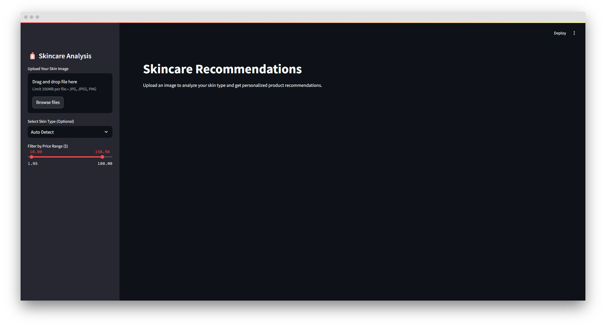

# Skincare Product Recommendation System

## Overview
The Skincare Product Recommendation System is a machine learning-based application designed to provide personalized skincare recommendations. By leveraging deep learning models for skin analysis and content-based filtering for product matching, this system helps users find the best skincare products tailored to their skin type and concerns.

## Features
### 1. **Skin Type Prediction**
- Upload an image of your skin, and the system predicts whether your skin type is **Oily, Dry, or Normal** using a **ResNet-50/101** model.

### 2. **Skin Concern Detection**
- The model identifies common skin concerns such as **Acne, Bags, Redness, Wrinkles**, etc., from the uploaded image.

### 3. **Personalized Product Recommendations**
- Based on the predicted skin type and concerns, the system suggests the most suitable skincare products using:
  - **Cosine Similarity** to match products based on skin type and concerns.
  - **TF-IDF Vectorization** to analyze ingredient-based similarity and provide relevant product recommendations.

## Technologies Used
- **Deep Learning Models:** Pre-trained **ResNet-50/101** for skin classification.
- **PyTorch:** For model inference and deep learning operations.
- **Streamlit:** For building an interactive and user-friendly web interface.
- **Pandas & Scikit-learn:** For data preprocessing and implementing the recommendation algorithm.
- **TF-IDF Vectorization:** For ingredient-based similarity analysis.

## How It Works
1. **Upload an Image**: Users upload an image of their skin.
2. **Model Prediction**: The system classifies skin type and detects concerns.
3. **Personalized Recommendations**: Using machine learning, the system suggests the best-matching skincare products.
4. **Explore Products**: Users receive recommendations along with product details and purchase links.

## Application Workflow
### Workflow Diagram

  

### Demo Screenshots

  

  

  

## Contact

For any queries or suggestions, feel free to reach out at [mahmoud.namnam72@gmail.com](mailto:mahmoud.namnam72@gmail.com).
